# SchedulEase - Time Table Management System for College 

Developed a user-friendly application for generating college semester timetables. Implemented a greedy algorithm to optimize scheduling, streamlining the process for administrators and faculty and enhancing coordination and efficiency. The application also manages department details, teacher details, the number of papers taught in each department per semester, and allotment details that gives information about which subjects have been assigned to teachers for teaching.

By closely examining the routine schedule our college currently follows, we designed and implemented a solution to automate the timetable creation process.

The application generates schedules for each semester of the respective departments. It can produce a personalized timetable for individual teachers, allowing them to view only their classes for the entire week. Additionally, it can generate a comprehensive timetable for the entire semester, encompassing all classes and subjects being taught.
Through this project, we have effectively addressed a practical issue, significantly improving the management of our college's academic schedules.

## Tech Stack
- Language : `PHP`, `SQL`
- Web development tools/Framework : `HTML`, `CSS`, `Bootstrap 5`
- Database: `MySQL`

## Home Page
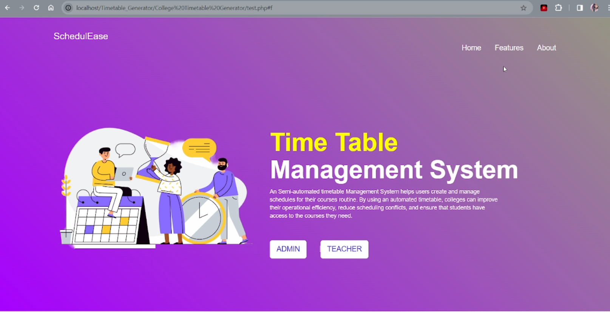
#
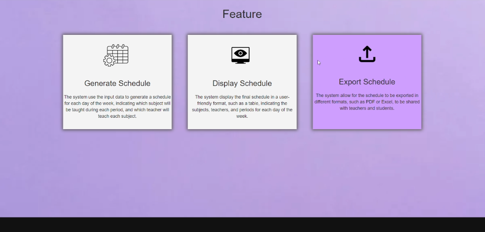
#
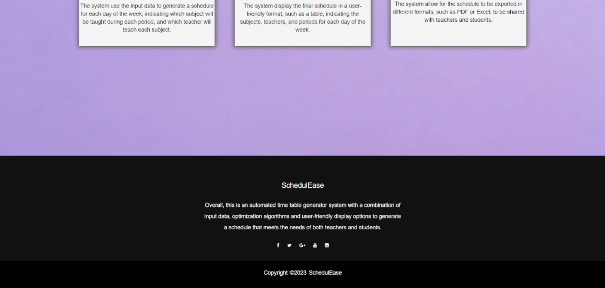
#

## Admin Login
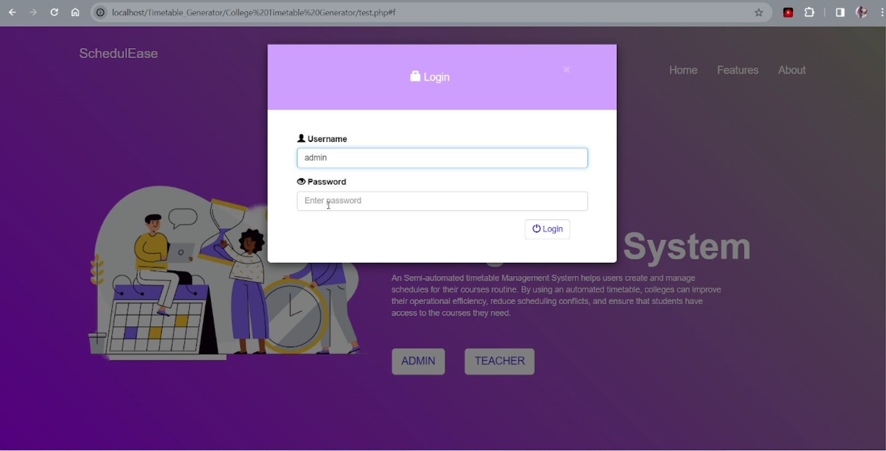
#

## Dashboard
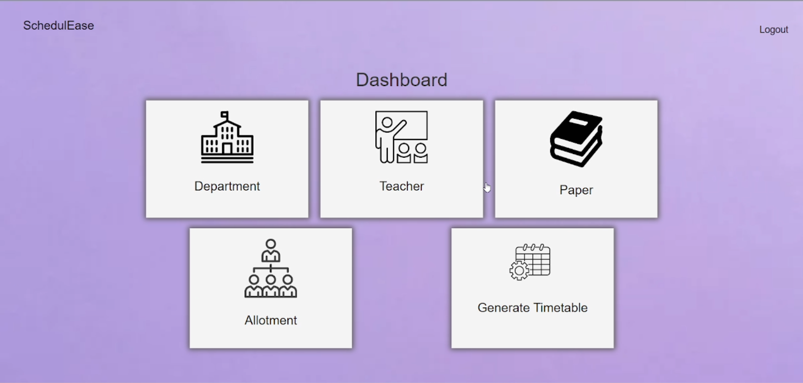

## Department Details
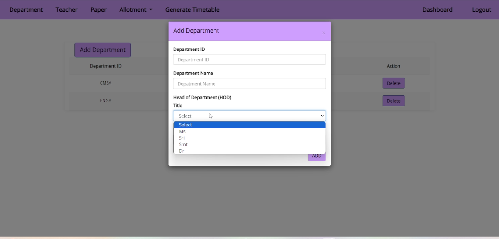
#

## Teacher Details
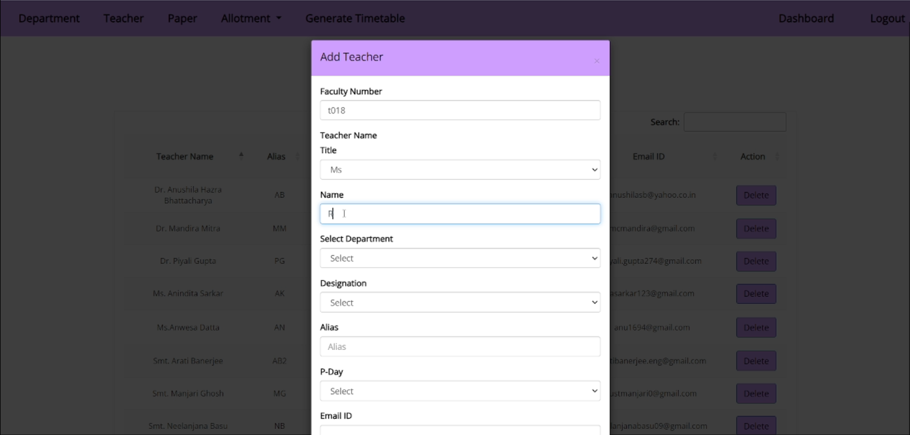
#

## Paper Details
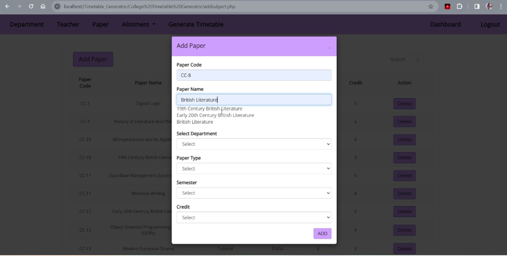
#

## Allotment Details
- Here, the subjects are allotted to teachers. The allotment section is divided into three categories: theory, practicals, and skill enhancement papers, which are labeled as "others."
#
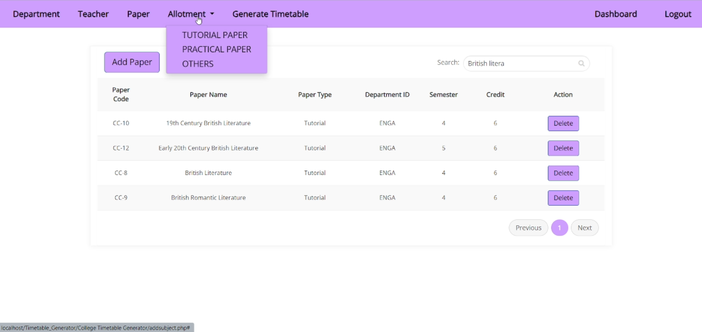
#

## Generate Timetable
- After successfully providing the details and allotting the subjects to the respective teachers, we can generate the schedule.
#
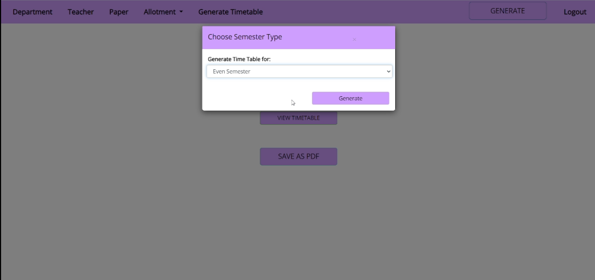
#

## Generated Timetable
- we can download the pdf for the generated timetable
#

#

## Teacher Login
#
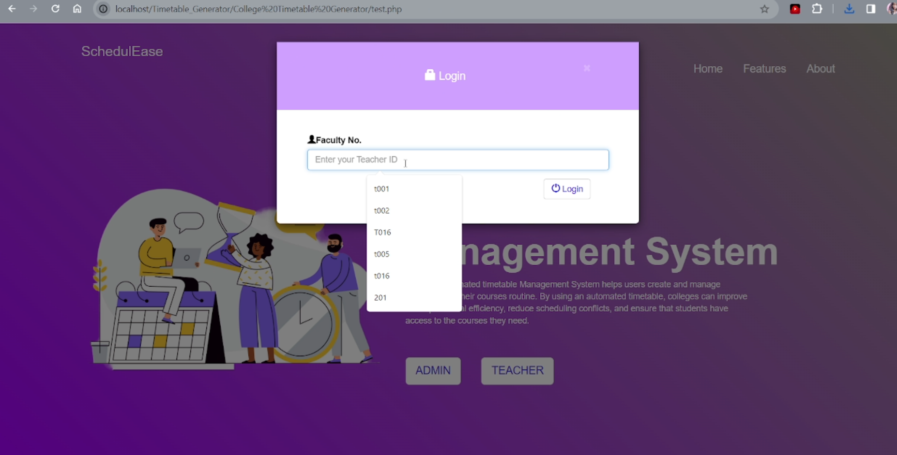
#

## Dedicated section for each teacher to view timetable
- Teacher can login to view the generated timetables
#
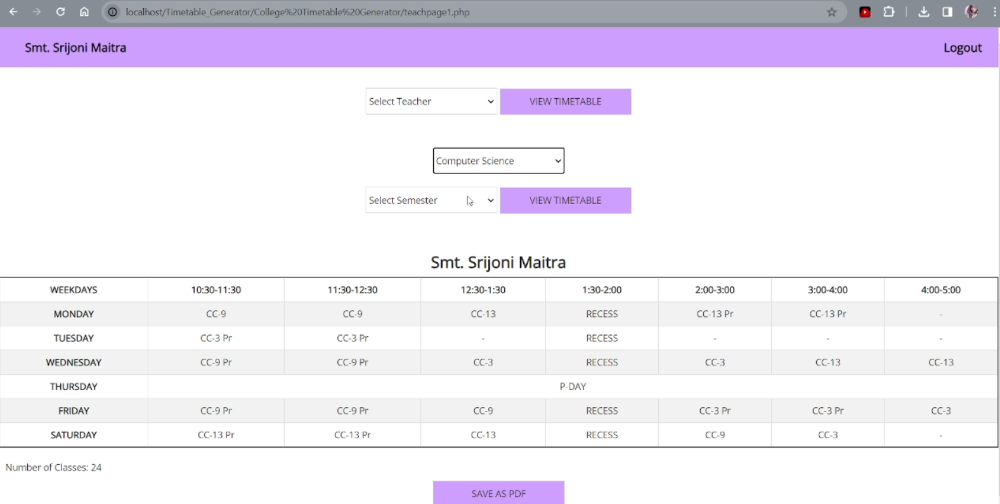
#
